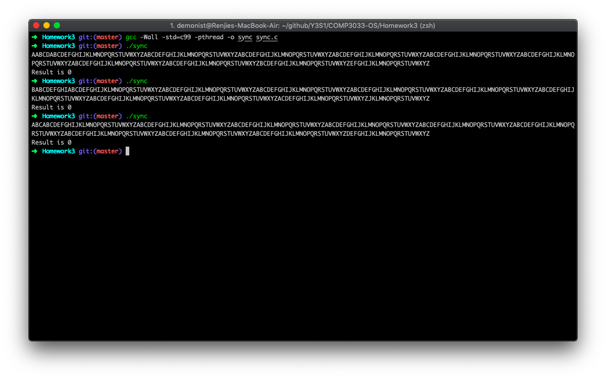

# Assignment 3

l630003010 Renjie Deng

```c
#include <stdio.h>
#include <pthread.h>
#include <stdlib.h>
#include <time.h>

#define N       26 // Total number of threads
#define M       10 // Number of loop iterations per thread
#define TRUE    1
#define FALSE   0

int sum = 0;
int flag[N] = {0}; // Initialize array for flag

// The function executed by each thread.
void *runner(void *param) {
    int i = *(int *)param; // This thread’s ID number.
    int m;
    int DOOR_OPENED = FALSE; // Check if the door is still opening
    int WANT_EXEC; // Check if any other process want to execute
    int FINISH_EXIT = FALSE; // Check if lower ID process have done exit
    int READY_LEAVE = FALSE; // Check if the current process is ready to leave
    
    for(m = 0; m < M; m++) {
        // Pi wants to enter the waiting room:
        flag[i] = 1;
        
        // Wait for open door
        while (!DOOR_OPENED) {
            DOOR_OPENED = TRUE;
            for (int j = 0; j < N; j++) {
                if (flag[j] > 2) {
                    DOOR_OPENED = FALSE;
                    break;
                }
            }
        }
        
        // Pi goes through the entrance door
        flag[i] = 3;
        // Check whether other process wants to enter the waiting room
        while (DOOR_OPENED) {
            int WAIT_ENTER = FALSE; // Check if other process want to enter
            for (int j = 0; j < N; j++) {
                if (j == i)
                    continue;
                if (flag[j] == 1) {
                    WAIT_ENTER = TRUE;
                    break;
                }
            }
            if (WAIT_ENTER) {
                // Then Pi starts waiting inside the waiting room
                flag[i] = 2;
                
                // Wait for a process to enter and close door
                WANT_EXEC = FALSE;
                while (!WANT_EXEC) {
                    for (int j = 0; j < N; j++) {
                        if (j == i)
                            continue;
                        if (flag[j] == 4) {
                            WANT_EXEC = TRUE;
                            break;
                        }
                    }
                }
            }
            DOOR_OPENED = FALSE;
        }
        
        flag[i] = 4; // Close the door when no process want to enter
        
        // Wait for all lower ID to finish exit protocol
        while (!FINISH_EXIT) {
            FINISH_EXIT = TRUE;
            for (int j = 0; j < i; j++) {
                if (flag[j] > 1) {
                    FINISH_EXIT = FALSE;
                    break;
                }
            }
        }
        
        // The Critical Section starts right below
        int s = sum;
        // Even threads increase s, odd threads decrease s.
        if(i % 2 == 0) {
            s++;
        }
        else {
            s--;
        }
        
        // Sleep a small random amount of time. Do not remove this code.
        struct timespec delay;
        delay.tv_sec = 0;
        delay.tv_nsec = 100000000ULL * rand() / RAND_MAX;
        nanosleep(&delay, NULL);
        
        sum = s;
        // The Critical Section ends right above
        
        // Ensure every process know the door is to be close
        while (!READY_LEAVE) {
            READY_LEAVE = TRUE;
            for (int j = i + 1; j < N; j++) {
                if (flag[j] == 2 || flag[j] == 3) {
                    READY_LEAVE = FALSE;
                    break;
                }
            }
        }
        
        flag[i] = 0; // Leave, reopen door if nobody still in waiting room
        
        // The Remainder Section starts here
        printf("%c", 'A' + i); // Print this thread’s ID number as a letter.
        fflush(stdout);
    }
    return 0; // Thread dies.
}

int main(void) {
    pthread_t tid[N]; // Thread ID numbers.
    int param[N]; // One parameter for each thread.
    int i;
    
    // Create N threads. Each thread executes the runner function with
    // i as argument.
    for(i = 0; i < N; i++) {
        param[i] = i;
        pthread_create(&tid[i], NULL, runner, &param[i]);
    }
    
    // Wait for N threads to finish.
    for(i = 0; i < N; i++) {
        pthread_join(tid[i], NULL);
    }
    
    printf("\nResult is %d\n", sum);
    return 0;
}
```


## Screenshot



